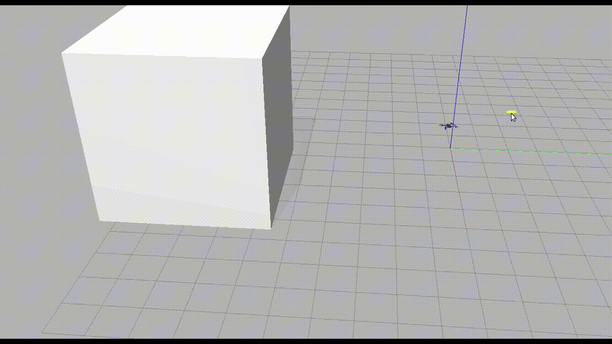

# UAV Testing Competition

  
  

Unmanned Aerial Vehicles (UAVs) equipped with onboard cameras and various sensors have already demonstrated the possibility of autonomous flights in real environments, leading to great interest in various application scenarios: crop monitoring, surveillance, medical and food delivery.

Over the years, support for UAV developers has increased with open-access projects for software and hardware, such as the autopilot support provided by [PX4](https://github.com/PX4/PX4-Autopilot) and [Ardupilot](https://github.com/ArduPilot/ardupilot).
However, despite the necessity of systematically testing such complex and automated systems to ensure their safe operation in real-world environments, there has been relatively limited investment in this direction so far.

The UAV Testing Competition organized jointly by the [International Conference on Software Testing, Verification and Validation (ICST)](https://conf.researchr.org/home/icst-2026) and [Search-Based and Fuzz Testing (SBFT) workshop](https://search-based-and-fuzz-testing.github.io/sbft26/) is an initiative designed to inspire and encourage the Software Testing Community to direct their attention toward UAVs as a rapidly emerging and crucial domain. The joint call is meant to help interested authors/participants reduce travel costs by selecting the most convenient and close venue.
  
## Competition Call

*The UAV Testing competition is back on for a 3rd Edition at SBFT@ICSE and at ICST 2026!*

The competition call, guidelines, and evaluation, are identical for the two calls.
You will have the option to choose where you want to participate and compete against the other competitors who applied for the same venue.

### Submission - SBFT@ICSE

The submission details for [SBFT@ICSE](https://search-based-and-fuzz-testing.github.io/sbft26/) participants are as follows:
- **Submission Deadline**: 31.11.2025 (AoE)
- **Notification**: 22.12.2025 (AoE)

### Submission - ICST

The submission details for [ICST](https://conf.researchr.org/home/icst-2026) participants are as follows:
- **Submission Deadline**: end-of-November (tentative)
- **Notification**: end-of-December (tentative)

<!-- ## Announcements

Wind! -->

## Getting Started

To get started with your submission, please check out our [Wiki Pages](https://github.com/skhatiri/UAV-Testing-Competition/wiki/Home), particularly, the [Getting Started](https://github.com/skhatiri/UAV-Testing-Competition/wiki/Getting-Started) page.

## License

The software we developed is distributed under MIT license. See the [license](./LICENSE.md) file.

